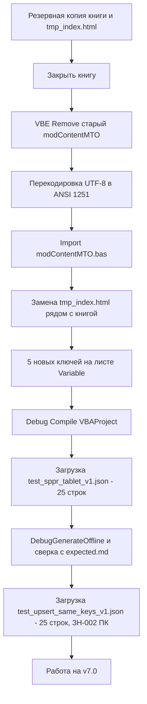

# Установка правок v7.0

> Версия документа: v1.0 от 07.09.2026.
> Описывает обновление РАБОЧЕЙ книги (v6.1 → v7.0) на месте (Путь A):
> данные `tbDATA`, лист `Variable`, кнопки и подключения сохраняются.
> Правки в v7.0 — только [`modContentMTO.bas`](../../src/vba/modContentMTO.bas),
> [`tmp_index.html`](../../tmp_index.html) и 5 новых ключей `Variable`.

## Что изменилось против v6.1

| Файл | Что и зачем |
|---|---|
| `src/vba/modContentMTO.bas` | доработка отчёта до 7 слайдов по постановке v1.1 (13 пунктов: Дашборд 1 с переключателем периодов, Блок 1 с окном по присутствующим `yearWeek` и набором зон `REPORT/SLIDE_ZONES`, Блок 2 с оценкой «норма/провал/мало данных», понедельный Блок 6 + рейтинг за отчётную неделю, топ-10 аномалий Блока 7, подблок 9а, выводы ИИ `slide1..slide7` с псевдонимизацией `[EMP_N]`, JSON-дамп расшифровки за 2 недели с клик-фильтром, офлайн-график по Блоку 2, подписи «как считается», статусы через `NormStatus`) |
| `tmp_index.html` | шаблон пересобран под 7 слайдов: Обзор; ДЭНТ; ДГМ; Синхронность; Дефекты и рейтинг; Динамика по дирекциям; Динамика по постам |
| лист `Variable` | 5 новых ключей (таблица ниже) |

Полный список пунктов и критерии приёмки — [`docs/task-for-coder.md`](../task-for-coder.md)
§2 и §6.

## Что НЕ менялось

- Core-модули (`modMain`, `modPQSync`, `modAIGateway`, `modHTMLEngine`, `modPivotBuilder`,
  `modAggregate`, `modColor`, `modLog`) и Power Query идентичны v6.1 — их не трогать.
- Формат столбца `Key` не менялся → **очистка `tbDATA` не требуется**, upsert работает штатно.

## Новые ключи листа Variable

| Key | Value | Назначение |
|---|---|---|
| `REPORT/WEEK` | `0` | отчётная неделя; `0`/пусто = авто (второй с конца присутствующий `yearWeek`); явное число = номер недели в последнем году, где она есть в данных |
| `REPORT/MIN_POST_RECORDS` | `10` | порог «мало данных» в оценке Блока 2 |
| `REPORT/SLIDE_ZONES` | `СТК+ПРК` | ремзоны второго экземпляра Блока 1 на слайдах дирекций (разделитель `+`); пусто = не выводить |
| `NormaForPlanshet` | `90` | порог «норма» Блока 2 |
| `ProvalForPlanshet` | `50` | порог «провал» Блока 2 |

## Порядок обновления (Путь A — на месте)

1. **Резервная копия.** Скопировать рабочую книгу и лежащий рядом `tmp_index.html`
   в отдельную папку (например `backup_v61_20260907\`). Откат = вернуть обе копии обратно.
2. **Закрыть рабочую книгу** (полностью, все окна).
3. **Переимпорт `modContentMTO`.** Открыть книгу → Alt+F11 → в дереве проекта найти
   `modContentMTO` → правой кнопкой → `Remove modContentMTO...` → на вопрос об экспорте — `No`.
   Затем импортировать свежий модуль. **Обязательно** перед импортом перекодировать
   исходник из UTF-8 в ANSI (Windows-1251): редактор VBA читает `.bas` только в ANSI,
   без перекодировки кириллица станет знаками `?`. Готовая команда PowerShell:

   ```powershell
   powershell -NoProfile -Command "$t=[IO.File]::ReadAllText('C:\Projects\ReportMTO\src\vba\modContentMTO.bas');[IO.File]::WriteAllText($env:TEMP+'\modContentMTO_ansi.bas',$t,[Text.Encoding]::GetEncoding(1251))"
   ```

   После команды в VBE: File → Import File → `%TEMP%\modContentMTO_ansi.bas`.
4. **Заменить шаблон.** Скопировать [`tmp_index.html`](../../tmp_index.html) в папку рядом
   с рабочей книгой (тот же каталог; `GenerateReport` ищет его по `ThisWorkbook.Path`).
5. **Добавить ключи Variable.** На листе `Variable` в таблицу Key/Value добавить 5 строк
   из таблицы выше (если ключ уже есть — проверить значение, не дублировать строку).
6. **Компиляция.** В VBE: Debug → Compile VBAProject. Должно пройти без ошибок.
7. **Проверка данных.** Нажать «Загрузить», выбрать `tests\test_sppr_tablet_v1.json` →
   строк в `tbDATA` должно стать 25.
8. **Проверка отчёта.** Alt+F8 → `DebugGenerateOffline` → в папке результата
   (`OUTPUT/RESULT_FOLDER`) появится `debug_*.html`. Сверить блоки с таблицей
   «Контроль отчёта» в [`tests/expected.md`](../../tests/expected.md) (Блок 1 ДГМ «Итого»
   42,1%; Блок 1 ДЭНТ «Итого» 0,0%; Блок 6 Иванов 75% / 8 подписаний; Блоки 7/8 — 1 пара,
   2,0 ч).
9. **Проверка upsert.** «Загрузить» → `tests\test_upsert_same_keys_v1.json` →
   строк по-прежнему 25, а у обеих строк `ЗН-002` поле `arm` = `ПК`.
   (Если получилось 2 строки — имя таблицы `tbDATA` отличается регистром; 26 — в таблице
   осталась пустая строка. Диагностика — в `tests/expected.md`.)

## Как откатиться

Закрыть книгу → вернуть из резервной копии книгу и прежний `tmp_index.html`.
Добавленные 5 ключей `Variable` можно оставить: код v6.1 их не читает, на поведение
они не влияют.

## Поток обновления



## Грабли, найденные при отладке v7.0 (на будущее)

- **Переменная `tab` совпала с ключевым словом VBA `Tab`.** VBA компилирует процедуры
  лениво — «Compile error: Syntax error» всплыл только при первом вызове Блока 6 из
  `BuildPlaceholders` и выглядел как зависание Excel (модальное окно VBE). Правило:
  не называть переменные именами функций и ключевых слов VBA (`Tab`, `Spc`, `Date`,
  `Name` и т.п.). Исправлено в v7.0.1 переименованием в `tabObj`.
- **`.bas` импортируется в ANSI 1251.** UTF-8 без перекодировки даёт `?` вместо
  кириллицы (шаг 3 инструкции).
- **Модальное окно ошибки VBA = «зависший» Excel.** Пока диалог не закрыт, Excel не
  отвечает на внешние вызовы. Диагностика: заголовки окон процесса EXCEL.EXE.
