# Презентация и блоки данных (МТО) — описание отчётности для руководства

> **Назначение:** единое описание отчётности «Контроль использования планшетов инженерами (ДГМ/ДЭНТ)»:
> аналитические блоки, Дашборд 1 и целевая презентация. Документ предназначен руководству и разработчикам.
>
> **Источник требований:** `docs/Презентация и блоки данных.docx` (требования руководства, ревизия 07.09.2026).
> **Выверено по:** [`docs/content-spec.md`](docs/content-spec.md:1) (v3.3.0), [`docs/spec.md`](docs/spec.md:1) (v3.1.0),
> коду [`src/vba/modContentMTO.bas`](src/vba/modContentMTO.bas:1) (v6.1) и шаблону [`tmp_index.html`](tmp_index.html:1).
>
> **Правило согласования:** при противоречии между этим документом и кодом верен код. Все расхождения между
> требованиями руководства и текущей реализацией зафиксированы явно: в каждом блоке — строка «Статус реализации»,
> сводно — в разделе 6 «Что требуется доработать/изменить в коде».
>
> ⚠️ После утверждения целевой структуры потребуется синхронизировать [`docs/content-spec.md`](docs/content-spec.md:157)
> и [`docs/spec.md`](docs/spec.md:538) (это отдельная задача, в объём данного документа не входит).

---

## 1. Общие требования и соглашения

### 1.1 Общее требование: гиперссылки на исходные данные

Каждая цифра в отчёте (если это поддаётся реализации) — **гиперссылка на исходные данные из таблицы `tbDATA`**.
Визуально цифры должны выглядеть как обычный текст.

**Целевой механизм (согласован):** готовый HTML-отчёт полностью офлайн и не видит книгу Excel, поэтому внутрь
отчёта встраивается обезличенный дамп исходных строк `tbDATA`, а клик по цифре раскрывает относящиеся к ней
исходные строки (номер ЗН, дата, статус, дата-время статуса, АРМ, пост). **Расшифровка охватывает только
предыдущую и текущую недели** — глубже опускаться не требуется, кроме случаев, которые заказчик опишет
отдельно. ФИО в раскрываемый дамп **включаются** (отчёт циркулирует внутри контура — решение заказчика
07.09.2026); во внешний ИИ ФИО не передаются никогда.

> **Статус реализации:** не реализовано ни в одном блоке. Наметка — см. раздел 5, п. 1.

### 1.2 Общий фильтр всех блоков

| Правило | Значение |
|---|---|
| `in_bounds` | только `ИСТИНА` |
| `arm` | только `ПК` и `ПЛАНШЕТ`; значение «НЕ ПОДПИСАНО» исключается всегда (строки без подписи статуса) |

Фильтр реализован в [`modContentMTO.bas`](src/vba/modContentMTO.bas:77) функциями
`FBase()`/`FArm()`/`FTablet()` (белый список `arm@=ПК;ПЛАНШЕТ`). Блоки, которым нужен только числитель
«% планшет», используют `FTablet()` (`arm=ПЛАНШЕТ`).

**Расшифровка данных (уточнение руководства):** все блоки считаются по **полной истории `tbDATA`**.
Ограничение «только предыдущая и текущая недели» относится исключительно к **расшифровке** — встроенному
дампу исходных строк, раскрываемому по клику на цифру (раздел 1.1). Глубже двух последних недель
расшифровка не опускается, кроме случаев, которые заказчик опишет отдельно.

### 1.3 Терминология (единая)

| Термин | Значение | Примечание |
|---|---|---|
| Заказ-наряд (ЗН) | Ремонт одной единицы техники; оформляется в 1С:ERP (EAM) | Один ЗН = один дефект |
| Событие / подписание | Одна строка `tbDATA`; факт смены статуса одной дирекцией с одного устройства | На один ЗН — 4 строки: 2 статуса × 2 дирекции |
| `Готов к приёмке` | Техника передана в ремзону | В данных 1С пишется через «е»: «Готов к приемке» — сравнение в коде нормализует «ё»→«е» ([`NormStatus()`](src/vba/modContentMTO.bas:883)); в исходном docx встречалось «Готов к выдаче» — это то же, что **«Готов к выбытию»** |
| `Готов к выбытию` | Ремонт завершён, техника возвращается | Завершающий статус ЗН |
| `% планшет` | Доля подписаний, выполненных с `ARM = ПЛАНШЕТ`, среди `ARM ∈ {ПК, ПЛАНШЕТ}` | Всегда доля, а не абсолютное число |
| АРМ (`arm`) | Устройство подписания: `ПК`, `ПЛАНШЕТ`, `НЕ ПОДПИСАНО` | «НЕ ПОДПИСАНО» исключается общим фильтром |
| Ремзона / пост | `post` (сырое значение 1С) → `postN` (нормализованное) | `post` — родитель поста; нормализация: «стк»→`СТК`, «прк»→`ПРК` |
| ПН | Предыдущая неделя | См. раздел 1.4 |
| ПН-N | Неделя за N недель до предыдущей | Пример: ПН = неделя 5 → ПН-1 = неделя 4, ПН-2 = неделя 3 |
| Дирекция | `ДГМ` (владелец ремзоны) / `ДЭНТ` (владелец техники) | Каждый статус подписывают обе дирекции независимо |

### 1.4 Отчётная неделя и ключ Variable `REPORT/WEEK`

**Периоды, используемые в отчётности:** «с начала года», «последняя неделя», «предыдущая неделя» (ПН).

**Ключ листа `Variable` — отчётная неделя (решение заказчика от 07.09.2026):**

| Ключ | Значение | Семантика |
|---|---|---|
| `REPORT/WEEK` | целое число — номер недели (1…50); пусто или `0` | Пусто/`0` → авто: `НЕДЕЛЯ(максимальная дата заказ-наряда) − 1` (текущая неделя обычно неполная, поэтому по умолчанию берётся предыдущая). Явное число → отчёты строятся за указанную неделю |

Отчётная неделя используется: Дашборд 1 (вариант «предыдущая неделя»), Блок 2 на Слайде 1 (предыдущая
неделя), Блок 6 (понедельная раскладка ПН-3…ПН и рейтинг — за отчётную неделю).

> **Статус реализации:** ключа нет. Сейчас `REPORT/WEEKS_WINDOW` = 8 используется только в Блоке 3 (KPI).
> Наметка — раздел 5, п. 2.

### 1.5 Оформление

- **Стилевой референс:** [`examples/remzona-reports.html`](examples/remzona-reports.html:1) — сверка компоновки
  и типографики (карточки, секции, таблицы, цифры tabular-nums).
- **Фактическая палитра проекта** — light-blue theme ([`content-spec.md` §9](docs/content-spec.md:346)):

  | Токен | Значение | Назначение |
  |---|---|---|
  | `--bg` | `#eaf3fb` | фон |
  | `--card` | `#ffffff` | карточки |
  | `--border` | `#cfe4f5` | границы |
  | `--ink` / `--ink-muted` | `#10283e` / `#5a7793` | текст |
  | `--accent` | `#0b6bcb` | акцент |
  | `--dgm` / `--dent` | `#0b6bcb` / `#0f8f8a` | маркеры дирекций |
  | шкала «% планшет» | `#ef4444 → #f59e0b → #10b981` | чем больше — тем зеленее; посередине — жёлтый |

- **Шрифты:** системные `Segoe UI` (текст) и `Consolas` (цифры). Внешние шрифты референса
  (Google Fonts: Oswald, IBM Plex) **не подключаются** — отчёт обязан работать офлайн.
- Цветовая шкала реализована в [`src/vba/modColor.bas`](src/vba/modColor.bas:1)
  (`PercentToColor` / `InterpolateHex`).

### 1.6 Единый шаблон описания блока

Каждый блок ниже описан по одинаковой схеме:

1. **Назначение** — на какой вопрос отвечает и кому.
2. **Параметры** — фильтры, задаваемые пользователем/конфигурацией.
3. **Фильтрация** — обязательные условия отбора строк.
4. **Строки / Столбцы / Значения** — структура таблицы.
5. **Оформление** — раскраска, особые элементы.
6. **Макет (пример)** — иллюстрация; цифры в примерах — демонстрационные, не фактические.
7. **Статус реализации** — что уже есть в коде, что расходится.
8. **Наметки** — ссылка на раздел 6.

---

## 2. Дашборд 1 (KPI, Блок 3)

**Назначение:** верхнеуровневые показатели на первой странице презентации — «здоровье» процесса в целом.

**Параметры:** период — «с начала года» / «последняя неделя» / «предыдущая неделя» (ПН по ключу
`REPORT/WEEK`, раздел 1.4). На Слайде 1 выводятся два экземпляра: «с начала года» и «предыдущая неделя».

| Показатель | Формула | Примечание |
|---|---|---|
| Период | подпись выбранного периода | отображается на форме |
| Создали заказ-нарядов | количество уникальных `number`, у которых `date` (дата создания) в периоде | решение заказчика: создание — по `date` |
| Закрыли заказ-нарядов | количество уникальных `number` со статусом «Готов к выбытию» в периоде (по `status_date`) | |
| `% планшет` | доля событий `ARM = ПЛАНШЕТ` среди `ARM ∈ {ПК, ПЛАНШЕТ}` за период | |
| Без поста ремзоны | количество уникальных `number` с пустым `postN` за период | индикатор качества учёта (в реальных данных ~33 % нарядов без поста) |
| Медиана | медиана разницы во времени по каждому ЗН: `status_date` «Готов к выбытию» − `status_date` «Готов к приёмке» | формат вывода «чч:мм» (например «5:20») — решение заказчика |

**Оформление:** карточки KPI в одном ряду; значения крупно, подписи мелко.

**Статус реализации:**
- Реализовано ([`BuildBlock3KPI()`](src/vba/modContentMTO.bas:455)): «Всего ЗН за последние `REPORT/WEEKS_WINDOW`
  недель», «% планшет ДГМ/ДЭНТ за текущую неделю» и «Δ к предыдущей неделе» в п.п.
- Не реализовано: переключатель периодов (с начала года / последняя / предыдущая неделя), показатели
  «создали/закрыли ЗН», «без поста ремзоны», «медиана», второй экземпляр Дашборда под разные периоды.
- В коде «текущая неделя» = максимальный `yearWeek`, реально присутствующий в данных (не календарная неделя).

**Наметки:** раздел 5, п. 4.

---

## 3. Аналитические блоки

Нумерация блоков — по [`content-spec.md` §5](docs/content-spec.md:157).

### 3.1 Блок 1 — Доля использования планшетов в работе ремонтных зон (последние 8 недель)

1. **Назначение:** сколько подписаний сделано с планшета, а не с ПК, по дирекциям и неделям; руководство
   дирекций и ИТ-служба, внедряющая планшеты.
2. **Параметры:** Дирекция (ДГМ / ДЭНТ / обе); Ремзоны («Все» или перечисление, например `СТК`, `ПРК+СТК`).
3. **Фильтрация:**
   - записи за последние **8 недель** по полю `status_date` — статусы вне периода исключаются;
   - `in_bounds = ИСТИНА`;
   - `ARM ∈ {ПК, ПЛАНШЕТ}`; «НЕ ПОДПИСАНО» исключается;
   - Ремзона: если параметр «Ремзоны» не указан или равен «Все» — по всем, иначе фильтрация по перечислению.
4. **Строки:** уровень 1 — Дирекция; уровень 2 — АРМ («ПК», «ПЛАНШЕТ»). Под каждой дирекцией — строка
   «% планшет».
5. **Столбцы:** недели (по полю `week_status` / `yearWeek`).
6. **Значения:**
   - количество строк `Count`, где `arm` соответствует текущему разрезу (дирекция × АРМ);
   - «% планшет» = строки `ARM = ПЛАНШЕТ` / (ПЛАНШЕТ + ПК) × 100 по каждой неделе и дирекции.
7. **Оформление:** строка «% планшет» раскрашивается по шкале «чем больше — тем зеленее, чем меньше — тем
   краснее, посередине — жёлтый» (раздел 1.5). Пользовательский фильтр «Ремонтная зона» — необязателен
   в презентации.
8. **Макет (иллюстрация, цифры демонстрационные):**

   | Дирекция | АРМ | Нед. 28 | Нед. 29 | … | Нед. 36 |
   |---|---|---|---|---|---|
   | ДГМ | ПЛАНШЕТ | 681 | 817 | … | 312 |
   | ДГМ | ПК | 477 | 482 | … | 256 |
   | ДГМ | % планшет | 59 % | 63 % | … | 55 % |
   | ДЭНТ | ПЛАНШЕТ | 816 | 899 | … | 430 |
   | ДЭНТ | ПК | 342 | 400 | … | 138 |
   | ДЭНТ | % планшет | 70 % | 69 % | … | 76 % |

9. **Статус реализации:** реализовано ([`BuildBlock1Table()`](src/vba/modContentMTO.bas:512)) — строки
   «дирекция → АРМ», недели-столбцы, `Count`, строка «% планшет» с раскраской, пустые ячейки как «—».
   **Расхождение:** код строит таблицу по **всем** неделям снимка, не ограничивая последние 8 недель;
   параметры «Дирекция»/«Ремзоны» в функции отсутствуют (отбор можно сделать только внешним параметром).
10. **Наметки:** раздел 5, п. 3.

### 3.2 Блок 2 — Количество заказ-нарядов по постам ремзоны

1. **Назначение:** объём работы по постам ремзоны и доля планшета на каждом посте; главный механик,
   руководители постов.
2. **Параметры:** период; в исходном docx — «период по `status_date`»; для Слайда 1 — «предыдущая неделя».
3. **Фильтрация:** `in_bounds = ИСТИНА`, период по `status_date`.
4. **Строки:** `postN` (все посты ремзоны; пустой пост выводится отдельной строкой «пост не указан»).
5. **Столбцы:** Пост | Нарядов | Событий | % планшета | ДГМ | ДЭНТ | Оценка.
6. **Значения:**
   - **Нарядов** — `Count(Distinct number)` (уникальных заказ-нарядов, не строк);
   - **Событий** — `Count` строк (подписаний) по посту;
   - **% планшета** — доля событий с `ARM = ПЛАНШЕТ` по посту;
   - **ДГМ / ДЭНТ** — % планшет по посту отдельно для каждой дирекции;
   - **Оценка** — по значению «% планшета»: **норма** ≥ `NormaForPlanshet` (по умолчанию 90);
     **провал** < `ProvalForPlanshet` (по умолчанию 50). Промежуточные значения — без оценки (серая зона).
     При малом числе нарядов — «мало данных»: нарядов < `REPORT/MIN_POST_RECORDS` (по умолчанию 10) —
     решение заказчика.
7. **Ключи `Variable` (новые):** `NormaForPlanshet` = 90, `ProvalForPlanshet` = 50, `REPORT/MIN_POST_RECORDS` = 10
   (в [`content-spec.md` §10](docs/content-spec.md:383) отсутствуют — наметка, раздел 5, п. 5).
8. **Оформление:** оценка выделяется цветом: «норма» — зелёный, «провал» — красный.
9. **Макет (иллюстрация):**

   | Пост | Нарядов | Событий | % планшета | ДГМ | ДЭНТ | Оценка |
   |---|---|---|---|---|---|---|
   | СТК | 2 543 | 10 172 | 86,7 | 81,3 | 92,1 | норма |
   | (пост не указан) | 2 216 | 8 864 | 39,7 | 34,7 | 44,8 | провал |
   | ПРК | 645 | 2 580 | 70,8 | 65,2 | 76,5 | норма |
   | Ангар №2 | 6 | 24 | 8,3 | 8,3 | 8,3 | мало данных |

10. **Статус реализации:** реализовано частично ([`BuildBlock2Table()`](src/vba/modContentMTO.bas:638)) —
    только колонки «Дирекция | Пост | Кол-во ремонтов» (честный `Distinct Count` по `number`).
    Не реализовано: колонки «Событий», «% планшета», «ДГМ», «ДЭНТ», «Оценка», пороги и ключи
    `NormaForPlanshet`/`ProvalForPlanshet`.
11. **Наметки:** раздел 5, п. 5.

### 3.3 Блок 3 — KPI

См. раздел 2 «Дашборд 1» — это один и тот же блок. В коде реализован как [`BuildBlock3KPI()`](src/vba/modContentMTO.bas:455).

### 3.4 Блок 4 — Динамика «% планшет» по дирекциям (по неделям)

1. **Назначение:** тренд доли планшета отдельно по ДГМ и ДЭНТ; вход для ИИ-выводов.
2. **Параметры:** период (по умолчанию — последние недели снимка).
3. **Фильтрация:** общий фильтр (раздел 1.2).
4. **Строки:** `direction` (ДГМ, ДЭНТ).
5. **Столбцы:** недели (`yearWeek`).
6. **Значения:** «% планшет» (доля, не количество!) по каждой дирекции и неделе; итоговая колонка.
7. **Оформление:** раскраска ячеек по шкале раздела 1.5; пустые ячейки — «—».
8. **Статус реализации:** реализовано ([`BuildPctMatrixTable("direction")`](src/vba/modContentMTO.bas:591)).
9. **Наметки:** нет (кроме общего п. 3 — применить окно недель, если потребуется).

### 3.5 Блок 5 — Динамика «% планшет» по постам ремзоны (по неделям)

1. **Назначение:** тренд доли планшета по постам; вход для ИИ-выводов.
2. **Параметры:** период.
3. **Фильтрация:** общий фильтр.
4. **Строки:** `postN`.
5. **Столбцы:** недели (`yearWeek`).
6. **Значения:** «% планшет» по каждому посту и неделе; итоговая колонка.
7. **Оформление:** раскраска по шкале; пустые ячейки — «—».
8. **Статус реализации:** реализовано ([`BuildPctMatrixTable("postN")`](src/vba/modContentMTO.bas:591)).
9. **Наметки:** нет (кроме общего п. 3).

### 3.6 Блок 6 — Статистика по людям

**Назначение:** персональная дисциплина использования планшета по каждому инженеру; руководство дирекций.
Имеет два представления: **целевое понедельное** (требование руководства) и **рейтинг** (реализованное
дополнение).

#### 3.6.1 Целевое представление — понедельная статистика (ПН-3…ПН)

1. **Параметры:** дирекция (ДГМ / ДЭНТ).
2. **Фильтрация:** дирекция; недели ПН, ПН-1, ПН-2, ПН-3 (ПН — по ключу `REPORT/WEEK`, раздел 1.4).
3. **Строки:** сотрудники (`employee`).
4. **Группы колонок:** каждая группа повторяется для ПН-3, ПН-2, ПН-1, ПН:

   | Группа | Формула |
   |---|---|
   | % планшет | доля подписаний с планшета за неделю |
   | ВСЕГО ПОДПИСЕЙ | количество уникальных `Key`, где сотрудник — ответственный за неделю |
   | ИЗ НИХ НА ПЛАНШЕТЕ | из «ВСЕГО ПОДПИСЕЙ» — с `ARM = ПЛАНШЕТ` |
   | из них Готов к приёмке | из «НА ПЛАНШЕТЕ» — с `ready_for = «Готов к приёмке»` |
   | из них Готов к выбытию | из «НА ПЛАНШЕТЕ» — с `ready_for = «Готов к выбытию»` |
   | среднее время между сменой статуса | средняя разница во времени по каждому ЗН сотрудника: `status_date` «Готов к выбытию» − `status_date` «Готов к приёмке» |

5. **Сортировка:** «% планшет» за ПН по убыванию.
6. **Макет (иллюстрация):**

   | Сотрудник | % планшет ПН-3…ПН | ВСЕГО ПОДПИСЕЙ ПН-3…ПН | ИЗ НИХ НА ПЛАНШЕТЕ | … |
   |---|---|---|---|---|
   | Сотрудник 1 | 50 %, … | … | … | … |
   | Сотрудник 2 | 49 %, … | … | … | … |

7. **Статус реализации:** не реализовано. В коде есть только рейтинг (см. 3.6.2). Наметка — раздел 5, п. 6.
8. **Ответственный сотрудник:** поле `employee` из записей статусов (решение заказчика — отдельного поля
   «ответственный» в выгрузке нет).
9. **Таблица по подразделениям (требование заказчика):** та же раскладка ПН-3…ПН, но строки —
   подразделения (`emp_dep`) вместо сотрудников.
10. **Описание расчёта в интерфейсе:** к блоку на форме добавляется краткое описание того, как он
    собирается (фильтр/формула). Требование распространяется на все блоки презентации.

#### 3.6.2 Дополнительное представление — рейтинг топ/антитоп (реализовано)

1. **Строки:** `employee`. **Значения:** «% планшет» (за отчётную неделю `REPORT/WEEK` — решение
   заказчика), количество подписаний, средняя длительность (`deltaHours`) в часах.
2. **Пороги:** топ и антитоп по `Variable/REPORT/TOPN` (по умолчанию 10); в рейтинг попадают сотрудники
   с числом записей не менее `Variable/REPORT/MIN_RECORDS` (по умолчанию 5).
3. **Сортировка:** по «% планшет» — топ по убыванию, антитоп по возрастанию.
4. **Статус реализации:** реализовано ([`Block6RankedTable()`](src/vba/modContentMTO.bas:691)).
5. ⚠️ Решение заказчика (07.09.2026): рейтинг считается за отчётную неделю. В коде сейчас — по всей
   истории; требуется правка (наметка, раздел 5, п. 6).

### 3.7 Блок 7 — Синхронность дирекций

1. **Назначение:** дирекции должны менять статусы синхронно — плюс-минус 5 минут. Блок показывает
   среднее отклонение между установкой статусов ДГМ и ДЭНТ и аномалии.
2. **Параметры:** период (по неделям из данных).
3. **Фильтрация:** пары ЗН, у которых статус «Готов к выбытию» зафиксирован в **обеих** дирекциях;
   общий фильтр раздела 1.2.
4. **Строки:** недели. **Столбцы:** Неделя | Средняя разница, ч | Пар нарядов.
5. **Значения:** среднее модуля разницы `status_date` «Готов к выбытию» между ДГМ и ДЭНТ по одному
   `number` (в часах) + количество пар.
6. **Целевое дополнение (из исходного docx):** «среднее и **10 аномалий**» — список из 10 нарядов
   с максимальным расхождением времени между дирекциями.
7. **Оформление:** строки со средней разницей выше порога `Variable/REPORT/SYNC_THRESHOLD_MIN`
   (значение в конфигурации — 5 минут; если ключ отсутствует, порог не применяется) подсвечиваются.
8. **Статус реализации:** реализовано среднее по неделям ([`BuildSyncPairs()`](src/vba/modContentMTO.bas:752) +
   [`BuildSyncTable(False)`](src/vba/modContentMTO.bas:842)) и подсветка порога. **Не реализовано:**
   топ-10 аномалий; доля нарядов, уложившихся в порог. Наметки — раздел 5, п. 7.

### 3.8 Блок 8 — Синхронность статусов по неделям×постам

1. **Назначение:** тот же показатель синхронности, что в Блоке 7, но в разрезе недель и постов — выявляет,
   где рассинхрон между дирекциями наибольший.
2. **Параметры:** период.
3. **Фильтрация:** как в Блоке 7; `postN` берётся от заказ-наряда целиком (из строки ДГМ).
4. **Строки:** неделя × пост. **Столбцы:** Неделя | Пост | Средняя разница, ч | Пар нарядов.
5. **Оформление:** подсветка превышения порога `SYNC_THRESHOLD_MIN`.
6. **Статус реализации:** реализовано ([`BuildSyncTable(True)`](src/vba/modContentMTO.bas:842)).

> ℹ️ В исходном docx под «Блок 8» было описано иное содержание («Вид дефекта × ДГМ/ДЭНТ, значение
> % планшет»). По согласованию нумерация взята из спек, а то содержание оформлено как подблок 9а (см. 3.9.2).

### 3.9 Блок 9 — Разбивка по видам ремонта/дефектов

#### 3.9.1 Основной блок

1. **Назначение:** структура дефектов/видов ремонта; контекст для синхронности и операционки.
2. **Фильтрация:** общий фильтр.
3. **Строки:** `zn_type`; дополнительный срез — `defekt_type` (если заполнен).
4. **Столбцы:** Вид ремонта | Тип дефекта | Кол-во. **Значения:** `Count` строк.
5. **Статус реализации:** реализовано ([`BuildBlock9Table()`](src/vba/modContentMTO.bas:663));
   пустой тип дефекта подписывается «не указан».

#### 3.9.2 Подблок 9а — «% планшет» по видам дефектов в разрезе дирекций

1. **Назначение:** доля планшета по каждому виду дефекта отдельно по ДГМ и ДЭНТ.
2. **Параметры:** дирекция (ДГМ / ДЭНТ — обе колонки одновременно).
3. **Фильтрация:** общий фильтр.
4. **Строки:** вид дефекта. **Столбцы:** Вид дефекта | ДГМ | ДЭНТ.
5. **Значения:** «% планшет» по каждой дирекции.
6. **Статус реализации:** не реализовано. Наметка — раздел 5, п. 8.

---

## 4. Презентация

### 4.1 Целевая раскладка (требование руководства)

```mermaid
flowchart TD
    P[Презентация] --> S1[Слайд 1 — Обзор]
    P --> S2[Слайд 2 — ДЭНТ]
    P --> S3[Слайд 3 — ДГМ]
    P --> S4[Слайд 4 — Синхронность]
    P --> S5[Слайд 5 — Дефекты и рейтинг]
    P --> S6[Слайд 6 — Динамика по дирекциям]
    P --> S7[Слайд 7 — Динамика по постам]

    S1 --> D1A[Верх лево — Дашборд 1, с начала года]
    S1 --> D1B[Верх право — Дашборд 1, предыдущая неделя]
    S1 --> B2[Низ — Блок 2, предыдущая неделя]
    S1 --> G2[Низ — график столбики по Блоку 2]

    S2 --> B1A[Блок 1 — ДЭНТ, все ремзоны]
    S2 --> B1B[Блок 1 — ДЭНТ, набор REPORT/SLIDE_ZONES]
    S2 --> B6A[Блок 6 — только ДЭНТ]
    S2 --> A2[Вывод ИИ — тренд ДЭНТ]

    S3 --> B1C[Блок 1 — ДГМ, все ремзоны]
    S3 --> B1D[Блок 1 — ДГМ, набор REPORT/SLIDE_ZONES]
    S3 --> B6B[Блок 6 — только ДГМ]
    S3 --> A3[Вывод ИИ — тренд ДГМ]

    S4 --> B7[Блок 7]
    S4 --> B8[Блок 8]
    S4 --> A4[Вывод ИИ — синхронность]

    S5 --> B9[Блок 9]
    S5 --> B9A[Подблок 9а]
    S5 --> B6R[Рейтинг Блока 6]

    S6 --> B4[Блок 4]

    S7 --> B5[Блок 5]
```

| Слайд | Состав |
|---|---|
| 1. Обзор | Верх лево: Дашборд 1 (с начала года); верх право: Дашборд 1 (предыдущая неделя); низ: Блок 2 (предыдущая неделя) + график-столбики по Блоку 2; вывод ИИ по слайду |
| 2. ДЭНТ | Блок 1 (только ДЭНТ, все ремзоны); Блок 1 (только ДЭНТ, набор `REPORT/SLIDE_ZONES`); Блок 6 (только ДЭНТ); вывод ИИ по тренду ДЭНТ и по людям |
| 3. ДГМ | Блок 1 (только ДГМ, все ремзоны); Блок 1 (только ДГМ, набор `REPORT/SLIDE_ZONES`); Блок 6 (только ДГМ); вывод ИИ по тренду ДГМ и по людям |
| 4. Синхронность | Блок 7; Блок 8; вывод ИИ по синхронности |
| 5. Дефекты и рейтинг | Блок 9; подблок 9а; рейтинг Блока 6 (топ/антитоп за отчётную неделю); вывод ИИ: кто стал лучше/хуже по итогам недель |
| 6. Динамика по дирекциям | Блок 4; вывод ИИ |
| 7. Динамика по постам | Блок 5; вывод ИИ |

> Все блоки 1–9 входят в презентацию (решение заказчика, охват полный). **ИИ-выводы — на всех 7 слайдах**,
> ключи ответа `slide1…slide7_conclusions`. Персональные выводы («кто стал лучше/хуже») строятся по
> **псевдонимам**: в DeepSeek передаются номера сотрудников, обратно номера заменяются на ФИО локально —
> таблица соответствия ФИО ↔ номер хранится только в книге и наружу не передаётся. К каждому блоку
> на форме выводится краткое описание расчёта.

### 4.2 Текущее состояние (реализовано в [`tmp_index.html`](tmp_index.html:86))

| Слайд | Название | Блоки | ИИ-вывод |
|---|---|---|---|
| 01 | Обзор | Блок 3 (KPI) | — |
| 02 | Свод по неделям и постам | Блок 1 | — |
| 03 | % планшет по дирекциям | Блок 4 | `slide3_conclusions` |
| 04 | Ремонты по постам | Блоки 2, 5 | `slide4_conclusions` |
| 05 | Синхронность дирекций | Блоки 7, 8, 9 | `slide5_conclusions` |
| 06 | Рейтинг инженеров | Блок 6 (топ/антитоп) | — |

Плейсхолдеры шаблона — [`spec.md` §9.2](docs/spec.md:667); словарь собирается в
[`BuildPlaceholders()`](src/vba/modContentMTO.bas:425).

### 4.3 План приведения (наметка в код)

- Пересборка [`tmp_index.html`](tmp_index.html:86) под 7 целевых слайдов (навигация 01…07).
- Новые плейсхолдеры: два Дашборда (`{{DASH_1_YTD}}`, `{{DASH_1_PREV}}`), Блок 2 за ПН
  (`{{BLOCK_2_PREV}}`), график по Блоку 2 (`{{BLOCK_2_CHART}}`), по два экземпляра Блока 1
  (`{{BLOCK_1_DENT_ALL}}`, `{{BLOCK_1_DENT_ZONES}}`, `{{BLOCK_1_DGM_ALL}}`, `{{BLOCK_1_DGM_ZONES}}`),
  по одному Блоку 6 на дирекцию (`{{BLOCK_6_DENT}}`, `{{BLOCK_6_DGM}}`), Блоки 7/8,
  Слайд 5 (`{{BLOCK_9_TABLE}}`, `{{BLOCK_9A_TABLE}}`, `{{BLOCK_6_RATING}}`), Слайд 6 (`{{BLOCK_4_TABLE}}`),
  Слайд 7 (`{{BLOCK_5_TABLE}}`).
- Выводы ИИ — на всех 7 слайдах, ключи `slide1…slide7_conclusions` (решение заказчика):
  [`BuildPrompt()`](src/vba/modContentMTO.bas:175), [`ParseAIResponse()`](src/vba/modContentMTO.bas:297),
  [`BuildPlaceholders()`](src/vba/modContentMTO.bas:425).
- Псевдонимизация персональных выводов: в [`BuildPrompt()`](src/vba/modContentMTO.bas:175) — маппинг
  `employee` → «Сотрудник N» (стабильная сортировка), в DeepSeek уходят номера; [`BuildPlaceholders()`](src/vba/modContentMTO.bas:425)
  выполняет обратную замену номеров на ФИО при вставке в HTML. Таблица соответствия — только в книге.
- Рефакторинг функций генерации: [`BuildBlock1Table()`](src/vba/modContentMTO.bas:512) и понедельный
  Блок 6 должны принимать параметры «дирекция» и «ремзоны» (сейчас строят по всем данным сразу);
  [`BuildBlock3KPI()`](src/vba/modContentMTO.bas:455) — параметр периода.
- К каждому блоку на слайде — краткое описание расчёта (фильтр/формула) прямо в интерфейсе
  (требование заказчика).
- Сводно — раздел 5, п. 9.

---

## 5. Сводная таблица «Что требуется доработать/изменить в коде»

| № | Что | Где в коде | Статус | Приоритет |
|---|---|---|---|---|
| 1 | Гиперссылки на `tbDATA`: встроить обезличенный дамп исходных строк за предыдущую и текущую недели и раскрытие по клику на цифру (раздел 1.1) | все `Build*Table` в [`modContentMTO.bas`](src/vba/modContentMTO.bas:1), [`modHTMLEngine.bas`](src/vba/modHTMLEngine.bas:1), скрипт в [`tmp_index.html`](tmp_index.html:1) | не реализовано | Высокий (общее требование) |
| 2 | Ключ `Variable`: `REPORT/WEEK` — отчётная неделя (пусто/0 = авто: неделя последнего ЗН − 1) и применение в Блоке 6, Дашборде, Блоке 2 (раздел 1.4) | [`modMain.bas`](src/vba/modMain.bas:1) `GetVariableDef`, [`modContentMTO.bas`](src/vba/modContentMTO.bas:1) | не реализовано | Высокий |
| 3 | Ограничение окна «последние 8 недель» в Блоке 1 (и при необходимости в Блоках 4/5) | [`BuildBlock1Table()`](src/vba/modContentMTO.bas:512) — сейчас все недели снимка | расхождение с docx | Высокий |
| 4 | Дашборд 1: переключатель периодов (год/последняя/предыдущая неделя), показатели «создали/закрыли ЗН» (по `date` / `status_date` «Готов к выбытию»), «без поста ремзоны», «медиана» (вывод «чч:мм»), два экземпляра | расширение [`BuildBlock3KPI()`](src/vba/modContentMTO.bas:455) | частично | Высокий |
| 5 | Блок 2: колонки «Событий», «% планшета», «ДГМ», «ДЭНТ», «Оценка» + ключи `NormaForPlanshet`/`ProvalForPlanshet`/`REPORT/MIN_POST_RECORDS` + правило «мало данных» | [`BuildBlock2Table()`](src/vba/modContentMTO.bas:638), лист `Variable` | частично | Высокий |
| 6 | Блок 6: понедельная раскладка ПН-3…ПН по сотрудникам и по подразделениям (`emp_dep`) + рейтинг за отчётную неделю (`REPORT/WEEK`) | новый `BuildBlock6Weekly` рядом с [`Block6RankedTable()`](src/vba/modContentMTO.bas:691); рейтинг — ограничить отчётной неделей | не реализовано | Высокий |
| 7 | Блок 7: топ-10 аномалий (наряды с максимальным расхождением) + опц. доля «в пороге» | [`BuildSyncPairs()`](src/vba/modContentMTO.bas:752), [`BuildSyncTable()`](src/vba/modContentMTO.bas:842) | частично | Средний |
| 8 | Блок 9а: «% планшет» по видам дефектов × дирекция | новая функция рядом с [`BuildBlock9Table()`](src/vba/modContentMTO.bas:663) | не реализовано | Средний |
| 9 | Презентация: пересборка шаблона и [`BuildPlaceholders()`](src/vba/modContentMTO.bas:425) под 7 целевых слайдов (Обзор, ДЭНТ, ДГМ, Синхронность, Дефекты и рейтинг, Динамика по дирекциям, Динамика по постам); ИИ — `slide1…slide7_conclusions` + псевдонимизация ФИО ↔ номер; параметризация блоков по дирекции/ремзонам/периоду (раздел 4.3) | [`tmp_index.html`](tmp_index.html:86), [`modContentMTO.bas`](src/vba/modContentMTO.bas:1) | расхождение с целевой раскладкой | Высокий |
| 10 | График-столбики по Блоку 2 (офлайн, инлайн-SVG/JS без внешних библиотек) | [`tmp_index.html`](tmp_index.html:1) + данные из Блока 2 | не реализовано | Средний |
| 11 | Сквозная проверка терминологии статусов («Готов к приёмке»/«Готов к выбытию») во всех сравнениях | [`modContentMTO.bas`](src/vba/modContentMTO.bas:883) (частично сделано — `NormStatus`) | проверка | Низкий |
| 12 | После утверждения — синхронизировать [`content-spec.md`](docs/content-spec.md:157) и [`spec.md`](docs/spec.md:538) с целевой структурой | документация | вне кода | — |
| 13 | Подписи-описания расчёта к каждому блоку на слайдах (требование заказчика) | [`tmp_index.html`](tmp_index.html:1) + тексты из разделов 2–3 | не реализовано | Средний |

---

## 6. Решения по открытым вопросам (согласовано с заказчиком 07.09.2026)

| № | Вопрос | Принятое решение | Источник |
|---|---|---|---|
| 1 | Отчётная неделя (ключ `Variable`) | `REPORT/WEEK`: пусто/0 = авто (неделя последнего ЗН − 1); явное число = указанная неделя | решение заказчика |
| 2 | «Создали заказ-нарядов» — по какому полю | создано — по `date`; закрыто — по `status_date` «Готов к выбытию» | решение заказчика |
| 3 | Порог «мало данных» в оценке Блока 2 | нарядов < `REPORT/MIN_POST_RECORDS` (по умолчанию 10) | решение заказчика |
| 4 | ИИ-выводы в презентации | на всех 7 слайдах; ключи `slide1…slide7_conclusions`; персональные выводы — через псевдонимы (ФИО ↔ номер; в DeepSeek — номера, обратная замена локально) | решение заказчика |
| 5 | Размещение Блока 9/9а и рейтинга Блока 6 | Слайд 5 «Дефекты и рейтинг»; полный охват блоков — Слайды 6–7 (Блоки 4, 5) | решение заказчика |
| 6 | Формат медианы Дашборда 1 | «чч:мм» (например «5:20») | решение заказчика |
| 7 | Набор ремзон на слайдах дирекций | `REPORT/SLIDE_ZONES` (по умолчанию `СТК+ПРК`; пусто = без второго экземпляра) | решение заказчика |
| 8 | Ответственный сотрудник в Блоке 6 | `employee`; отдельного поля нет. Дополнительно: таблица Блока 6 по подразделениям (`emp_dep`); описание расчёта каждого блока в интерфейсе | решение заказчика |
| 9 | Период «% планшет» рейтинга Блока 6 | за отчётную неделю (`REPORT/WEEK`), порог `MIN_RECORDS` сохраняется | решение заказчика |
| 10 | ФИО в раскрываемой расшифровке | включаются (внутренний контур); во внешний ИИ ФИО не передаются — только псевдонимы | решение заказчика |
| 11 | Исключения расшифровки глубже двух недель | описываются заказчиком отдельно по мере возникновения | договорённость |

---

## 7. Журнал изменений

**07.09.2026 — v1.0:** документ создан на основе `docs/Презентация и блоки данных.docx` (ревизия 07.09.2026)
с приведением к единой структуре и сверкой со спецификациями и кодом. Зафиксированы согласованные решения:
целевая раскладка презентации из docx, нумерация блоков из спек (1–9), понедельный Блок 6 как целевой,
подблок 9а, гиперссылки на `tbDATA` через встроенный дамп.

**07.09.2026 — v1.1:** согласованы с заказчиком открытые вопросы: ключ `REPORT/WEEK`; создано по `date` /
закрыто по `status_date` «Готов к выбытию»; `REPORT/MIN_POST_RECORDS` = 10; медиана «чч:мм»;
`REPORT/SLIDE_ZONES`; рейтинг Блока 6 за отчётную неделю; таблица Блока 6 по подразделениям; описания
расчёта в интерфейсе; ФИО в расшифровке. Целевая презентация расширена до 7 слайдов (полный охват блоков
1–9): добавлены Слайд 5 «Дефекты и рейтинг», Слайд 6 «Динамика по дирекциям», Слайд 7 «Динамика по постам».
ИИ-выводы — на всех 7 слайдах (`slide1…slide7_conclusions`) с псевдонимизацией ФИО ↔ номер.
